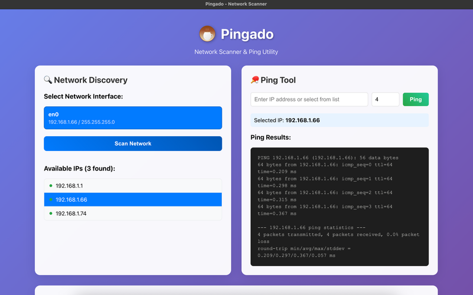

#  Pingado - Cross-Platform Network Scanner & Ping Utility

[](https://github.com/paulohva/pingado/releases)
[](https://github.com/paulohva/pingado/releases)
[](LICENSE)

<br clear="left"/>

A modern cross-platform desktop application for network discovery and ping testing. **"Pingado"** is Portuguese for *coffee with milk* ☕ - representing the perfect blend of simplicity and power in network utilities.



## 📥 Download & Install

> 🚀 **Ready to use!** Just download and install - no technical setup required.

### 🖥️ Choose Your Platform

| Platform | Download | Installation |
|----------|----------|--------------|
| **🪟 Windows** | [Download Installer](https://github.com/paulohva/pingado/releases) | Run `Pingado-Setup-X.X.X.exe` |
| **🍎 macOS** | [Download DMG](https://github.com/paulohva/pingado/releases) | Open `.dmg` and drag to Applications |
| **🐧 Linux** | [Download AppImage](https://github.com/paulohva/pingado/releases) | Make executable and run |

### 📦 Installation Types

**Windows:**
- **🔧 Installer** (`Pingado-Setup-X.X.X.exe`) - Installs to Program Files with shortcuts
- **📦 Portable** (`Pingado-X.X.X.exe`) - No installation needed, run directly

**macOS:**
- **💿 DMG Package** (`Pingado-X.X.X.dmg`) - Standard macOS installer
- **📁 ZIP Archive** (`Pingado-X.X.X.zip`) - Extract and drag to Applications

**Linux:**
- **🚀 AppImage** (`Pingado-X.X.X.AppImage`) - Universal, no installation needed
- **📦 DEB Package** (`pingado_X.X.X_amd64.deb`) - For Debian/Ubuntu: `sudo dpkg -i filename.deb`
- **📦 RPM Package** (`pingado-X.X.X.x86_64.rpm`) - For RedHat/CentOS: `sudo rpm -i filename.rpm`

## 🚀 Quick Start

1. **📥 Download** from the links above
2. **⚡ Install** using your platform's method
3. **🎯 Launch** Pingado from your Applications/Start Menu
4. **🔍 Click "Scan Network"** to discover devices
5. **🏓 Select an IP** and click "Ping" to test connectivity

## ✨ Features

- 🔍 **Network Discovery**: Automatically find all devices on your local network
- 🌐 **IP Scanning**: See what's connected to your WiFi/network
- 🏓 **Ping Tool**: Test if websites or devices are reachable
- 📊 **Network Info**: View your network details and statistics  
- 🎨 **Modern Interface**: Clean, easy-to-use design
- 💻 **Works Everywhere**: Windows, macOS, and Linux support

## 🎯 How to Use

### Find Devices on Your Network
1. Open Pingado
2. Click **"Scan Network"** 
3. Wait for the scan to complete
4. See all connected devices in the list

### Test Internet/Device Connection
1. Enter an IP address (like `8.8.8.8` for Google DNS)
2. Or click on a device from your network scan
3. Choose how many pings to send (1-10)
4. Click **"Ping"** to test the connection
5. View the results showing response times

## ❓ Troubleshooting

### Common Issues

**🚫 App won't start?**
- Make sure you downloaded the right version for your operating system
- On macOS: Right-click the app and select "Open" if Gatekeeper blocks it
- On Windows: Windows Defender might flag it - click "More info" then "Run anyway"
- On Linux: Make the AppImage executable: `chmod +x Pingado-*.AppImage`

**🔍 Network scan not working?**
- Make sure you're connected to WiFi or ethernet
- Some devices might be hidden or not respond to ping
- Try running as administrator/sudo if needed

**🏓 Ping not working?**
- Check if the IP address is correct
- Some websites/devices block ping requests
- Firewall might be blocking the ping command

**💻 Still need help?**
- Check our [Issues page](https://github.com/paulohva/pingado/issues) for solutions
- Create a new issue with your problem description

---

## 🛠️ For Developers

<details>
<summary><strong>📋 Development Setup & Technical Details</strong></summary>

### System Requirements

#### Operating System Support
- ✅ **macOS** 10.13 (High Sierra) or later
- ✅ **Windows** 10 or later (Windows 11 recommended)
- ✅ **Linux** Ubuntu 18.04+, Fedora 32+, or equivalent

#### Software Prerequisites

**Required:**
- **Node.js** version 16.x or higher (18.x+ recommended)
  - Download from [nodejs.org](https://nodejs.org/)
  - Verify: `node --version` should show v16.0.0 or higher
- **npm** version 8.x or higher (included with Node.js)
  - Verify: `npm --version` should show 8.0.0 or higher

**Platform-Specific Requirements:**

**macOS:**
- Xcode Command Line Tools: `xcode-select --install`
- Python 3.x (usually pre-installed)

**Windows:**
- Windows Build Tools (automatically installed with npm packages)
- PowerShell or Command Prompt (Administrator privileges may be required)

**Linux:**
- Build essentials: `sudo apt-get install build-essential` (Ubuntu/Debian)
- Python 3.x and pip
- libgtk-3-dev: `sudo apt-get install libgtk-3-dev`

### Installation for Development

```bash
# 1. Clone and setup
git clone https://github.com/paulohva/pingado.git
cd pingado
npm install

# 2. Run in development
npm run dev
# OR use the launch script
./launch.sh
```

**Prerequisites:** Node.js 16+ and npm 8+ (see System Requirements above)

### Development Commands

```bash
npm run dev          # Start development with hot reload
npm run build        # Build for production (dist/ directory)
npm run cleanup      # Stop all webpack/electron processes
```

### Building for Distribution

**Quick Commands:**
```bash
# Build for current platform
npm run dist:mac    # or dist:win, dist:linux

# Build for all platforms  
npm run dist:all

# Using build scripts (recommended - with progress & error handling)

# Unix/macOS/Linux
./build.sh -p macos

# Windows (works with new Windows Terminal and Git Bash)  
./build.bat -p windows
```

**Build Script Options:**
- `-p <platform>` - windows, macos, linux, or all
- `--skip-deps` - Skip dependency installation (faster rebuilds)
- `--help` - Show all options

#### Testing Built Applications

After building, test your applications directly from the `release/` directory:

**macOS & Linux:**
```bash
# macOS
open release/mac-arm64/Pingado.app     # Apple Silicon
open release/mac/Pingado.app           # Intel

# Linux
chmod +x release/Pingado-X.X.X.AppImage && ./release/Pingado-X.X.X.AppImage
```

**Windows:**
```bash
# Windows (works with new Windows Terminal and Git Bash)
./release/Pingado-X.X.X.exe            # Portable executable
```

**Distribution Files Created:**
- **Windows**: Setup installer + portable executable
- **macOS**: DMG installers + ZIP archives (Intel & Apple Silicon)
- **Linux**: AppImage + DEB + RPM packages

### Technical Details

#### Architecture

- **Frontend**: React with TypeScript for the user interface
- **Backend**: Electron main process handles system operations
- **IPC Communication**: Secure communication between renderer and main processes
- **Network Operations**: Uses system ping commands for maximum compatibility

#### Platform Support

- **Windows**: Uses `ping -n` command
- **macOS/Linux**: Uses `ping -c` command
- **All Platforms**: Automatic network interface detection

#### Security & Privacy

- **Context isolation enabled** - Renderer process runs in isolated context
- **Node integration disabled** - Prevents direct Node.js access from renderer
- **Secure IPC communication** - All communication through preload script
- **No data collection** - Application runs entirely locally
- **No external connections** - Only local network scanning and ping
- **Open source** - Full source code available for security review

### Advanced Troubleshooting

#### Launch Script Issues

**macOS/Linux:**
```bash
# Make the script executable
chmod +x launch.sh

# If permission denied:
sudo chmod +x launch.sh

# Run with explicit shell
bash launch.sh
```

**Windows:**
```bash
# Windows (works with new Windows Terminal and Git Bash)
./launch.sh

# Or run directly:
npm run dev
```

#### Installation Problems
1. **Node.js Version Error**
   ```bash
   # Check version
   node --version
   
   # If too old, update Node.js from nodejs.org
   # Or use Node Version Manager (nvm)
   ```

2. **npm Install Failures**
   ```bash
   # Clear npm cache
   npm cache clean --force
   
   # Delete node_modules and reinstall
   rm -rf node_modules package-lock.json
   npm install
   ```

3. **Python/Build Tools Missing**
   ```bash
   # Windows (run as Administrator)
   npm install --global windows-build-tools
   
   # macOS
   xcode-select --install
   
   # Linux (Ubuntu/Debian)
   sudo apt-get install build-essential python3-dev
   ```

#### Runtime Issues
1. **Permission Errors**: On some systems, ping commands may require elevated privileges
   - **Windows**: Run as Administrator
   - **macOS/Linux**: May need `sudo` for some network operations

2. **Firewall Blocking**: Ensure your firewall allows ping requests
   - Check system firewall settings
   - Some corporate networks block ping

3. **Network Discovery Issues**: Some devices may not respond to ping requests
   - Devices with strict security settings
   - IoT devices that don't respond to ping
   - VPN connections may interfere

4. **Port Already in Use**
   ```bash
   # Kill existing processes
   npm run cleanup
   
   # Or manually:
   pkill -f webpack
   pkill -f electron
   ```

#### Electron Window Issues
1. **Empty/Blank Window**
   - Check developer console for JavaScript errors
   - Ensure React components are loading
   - Verify webpack dev server is running on port 3000

2. **Window Not Opening**
   - Check if Electron process is running
   - Look for error messages in terminal
   - Try: `npm run cleanup && npm run dev`

#### Platform-Specific Notes

**Windows:**
- May require running as Administrator for network operations
- Use PowerShell or Command Prompt
- Windows Defender may flag the application initially

**macOS:**
- Firewall settings may affect network discovery
- Gatekeeper may require allowing the app to run
- Network permissions dialog may appear

**Linux:**
- Some distributions require additional network permissions
- AppImage format for distribution
- May need to install additional GTK dependencies

#### Getting Help

If you encounter issues:
1. Check the console output for error messages
2. Verify all prerequisites are installed
3. Try the cleanup command: `npm run cleanup`
4. Restart with: `npm run dev`

**Debug Mode:**
```bash
# Run with verbose output
npm run dev --verbose

# Check webpack compilation
npm run build
```

</details>

## 🤝 Contributing

We welcome contributions! Here's how you can help:

### 🐛 Reporting Issues
- Use the [GitHub Issues](https://github.com/paulohva/pingado/issues) page
- Include your OS, version, and detailed steps to reproduce
- Attach screenshots if relevant

### 💡 Feature Requests
- Check existing issues first to avoid duplicates
- Describe the feature and its use case
- Consider if it fits the project's scope

### 🔧 Code Contributions
1. Fork the repository
2. Create a feature branch: `git checkout -b feature/amazing-feature`
3. Make your changes and test thoroughly
4. Commit with clear messages: `git commit -m 'feat: add amazing feature'`
5. Push to your fork: `git push origin feature/amazing-feature`
6. Open a Pull Request with a detailed description

### 📋 Development Setup

For complete development setup instructions, system requirements, and technical details, see the **[🛠️ For Developers](#-for-developers)** section above.

### 🧪 Testing
- Test on your target platforms
- Verify network scanning and ping functionality
- Check the build process: `npm run build`

Feel free to reach out if you need help getting started!

## 📝 Changelog

### v1.0.3 (Latest) ☕
- 🔊 **Sound Effects & User Experience**
- ✅ Added ping sound effect for better user feedback
- ✅ Optimized audio file (20KB MP3) for fast loading
- ✅ 30% volume level to avoid being jarring
- ✅ Graceful fallback if audio playback fails
- ✅ Enhanced webpack configuration for audio files

### v1.0.2 ☕
- 🔧 **Cross-Platform Improvements**
- ✅ Fixed Windows compatibility issues with cleanup command
- ✅ Enhanced README with better platform separation (Linux/Mac vs Windows)
- ✅ Updated Windows commands to use `./` syntax (works with new Windows Terminal)
- ✅ Cleaner development workflow without unnecessary process killing
- ✅ Updated package-lock.json with latest dependencies

### v1.0.1 ☕
- ✨ **Enhanced Branding Release**
- ✅ Beautiful custom coffee mug icon with cultural Portuguese identity
- ✅ Professional React UI integration with coffee mug branding
- ✅ Real application screenshots in documentation
- ✅ Comprehensive README with user and developer guides
- ✅ Complete icon package (SVG, PNG, ICO, ICNS) for all platforms
- ✅ Enhanced visual identity and professional presentation

### v1.0.0 ☕
- 🎉 **Initial Release**
- ✅ Cross-platform network scanning and ping functionality
- ✅ Modern React + TypeScript UI
- ✅ Comprehensive build system for Windows, macOS, and Linux
- ✅ Professional installers and portable versions
- ✅ Complete documentation and troubleshooting guides

### Upcoming Features
- 🔄 Network monitoring with continuous ping
- 📊 Enhanced network statistics and graphs  
- 🎯 Custom ping intervals and packet sizes
- 💾 Export scan results to CSV/JSON
- 🌙 Dark mode theme option

## 🏗️ Built With

- **[Electron](https://electronjs.org/)** - Cross-platform desktop framework
- **[React](https://reactjs.org/)** - UI library for building interfaces
- **[TypeScript](https://typescriptlang.org/)** - Type-safe JavaScript
- **[Webpack](https://webpack.js.org/)** - Module bundler and build tool
- **[electron-builder](https://electron.build/)** - Application packaging and distribution

## 📊 Project Stats


## License

MIT License - see [LICENSE](LICENSE) file for details.

---

<div align="center">
  <strong>Made with ❤️ for network administrators and developers</strong>
  <br>
  <a href="https://github.com/paulohva/pingado/releases">Download</a> • 
  <a href="https://github.com/paulohva/pingado/issues">Report Bug</a> • 
  <a href="https://github.com/paulohva/pingado/issues">Request Feature</a>
</div>
